# Competition registration lifecycle

A **team** is a reusable name, leader and membership list. A **team registration**
is that team's entry in one competition. Its accepted roster, price, approval,
order and activation belong to that competition. The same team can enter several
competitions; one team can have only one registration in any given competition.

## States and actors

```mermaid
stateDiagram-v2
    [*] --> Team: Leader creates team
    state Team {
        [*] --> Forming
        Forming --> Deleted: Leader / no registration or purchase history
        Forming --> Forming: Leader invites; invitee responds
    }
    Team --> PendingApproval: Leader registers / approval required
    Team --> PendingPayment: Leader registers / paid, no approval required
    Team --> Active: Leader registers / free, no approval required
    PendingApproval --> PendingPayment: Staff approves / paid
    PendingApproval --> Active: Staff approves / free
    PendingApproval --> Rejected: Staff rejects
    PendingApproval --> Cancelled: Leader cancels
    PendingPayment --> Cancelled: Leader cancels / no linked order
    PendingPayment --> PendingPayment: Leader checkout / retry / order cancelled
    PendingPayment --> Active: Settled order fulfillment
    Active --> Active: Same settled order replay / no side effects
    Active --> [*]
    Rejected --> [*]
    Cancelled --> [*]
```



Canonical registration statuses are `pending_approval`, `pending_payment`,
`active`, `rejected`, `cancelled`. Checkout, gateway attempts and payment failure
are shop/payment states, not registration states. Failed payment leaves an
approved registration in `pending_payment`, allowing retry with the same seat.

| Action | Actor | Preconditions / result |
| --- | --- | --- |
| Create / invite | Leader | Leader is automatically accepted; invitee exists |
| Accept / reject | Named invitee | Pending, unexpired invitation |
| Register | Leader | Open competition, valid accepted size, capacity, no conflicting roster |
| Approve / reject | Staff | Only `pending_approval`; save actor, timestamp and remarks |
| Checkout | Leader | Only `pending_payment`; reuse linked payable order |
| Activate | Shop fulfillment | Approved registration, matching settled order item, leader and price |
| Cancel registration | Leader | Pending and unpaid; first cancel any linked order |
| Delete team | Leader | No registration or purchase history |

Rejected and cancelled registrations are terminal and retained for history.
Active entries require a separately designed administrative revocation/refund
operation; general team deletion and unpaid cancellation cannot remove them.

## Membership and invitations

Membership statuses are `pending`, `accepted`, `rejected`, `expired`. Invitations
expire after seven days. Rejection saves the membership record and response time.
A leader can renew a rejected/expired invitation, reusing its unique membership
row and clearing the old response time. Accepted membership and live pending
invitations cannot be duplicated. Database uniqueness also enforces one row per
user and team.

Only accepted memberships count for competition size and pricing. Pending or
rejected invitees do not block an otherwise eligible accepted roster. Registering
copies the accepted user IDs and freezes the total price. Later invitation
acceptance changes the reusable team, not existing competition rosters or orders.
The next competition registration uses the then-current accepted roster.

Users can belong to multiple reusable teams. Participation conflicts are scoped
to a competition: the reserved registration roster allows each user in only one
team there, including entries pending approval/payment. Rejection or cancellation
releases that conflict. Independent competitions do not conflict merely because
their dates overlap.

Expired invitations are omitted from the pending list and cannot be accepted even
if a scheduled cleanup has not run. Run `python manage.py expire_team_invitations`
periodically to mark unanswered expired rows. `invited_by`, `expires_at` and
`responded_at` are exposed in membership responses.

## Capacity and fulfillment

Group registration locks the competition row and then the team inside one database
transaction, checks capacity/conflicts and creates the registration and roster.
`pending_approval`, `pending_payment` and `active` all reserve a team slot. A
conditional unique constraint on competition/user additionally prevents duplicate
reserved participation.

Free solo registration and paid solo checkout also lock the competition row.
Checkout reserves a `pending_payment` solo entry tied to the order item, including
solo components in packs. Completed/free and pending-payment entries both consume
capacity. A retry or settlement excludes its own reservation from the capacity
check. Order cancellation/supersession releases the corresponding solo reservation.

The existing settlement route is:

```text
payment_core coordinator
  -> wallet.payment_settlement.settle_wallet_top_up
  -> WalletService: credit verified top-up, settle linked order
  -> shop.fulfillment.fulfill_order
  -> events.fulfillment.activate_team_registration
```

Payment-core remains independent of event models. Event services never call a
gateway or debit a wallet. The shop adapter creates the order for a registration;
the fulfillment handler validates the order link, leader, price and settlement
time before activating it. Order and registration locks make replay idempotent;
the same order item returns `created=False` without changing `activated_at`.
Another order cannot claim the already fulfilled registration.

Free registrations activate directly, or on staff approval, with no gateway
intent and no fake payment. A legitimately zero-total shop order still uses normal
shop fulfillment without a gateway. Cancelling a group payment order detaches the
order but leaves the approved competition reservation available for retry; use
registration cancellation to release its capacity.

Production concurrency requires PostgreSQL. SQLite does not provide the row-lock
behavior these operations depend on. See the [Django row-lock documentation](https://docs.djangoproject.com/en/5.2/ref/models/querysets/#select-for-update).

## API contract

Existing team URLs are retained. Team responses include `management_status:
"forming"`, `accepted_member_count`, and `registrations[]`. Every registration has
its own `competition_details`, canonical `status`, frozen `price`, `member_ids`,
`content_submission` (an object or `null`), `order_item`, review audit fields and
activation time. The submission belongs to that registration and is displayed
with its competition in team details.

| Endpoint | Request |
| --- | --- |
| `POST /api/my-teams/` | `team_name`, optional `member_emails` |
| `POST /api/my-teams/{team}/add-member/` | `email` |
| `POST /api/my-invitations/{team}/respond/` | `action: accept/reject`; returns membership, HTTP 200 |
| `POST /api/my-teams/{team}/register-competition/{competition}/` | Empty; returns team with registrations |
| `POST /api/my-teams/{team}/review-registration/{competition}/` | Staff: `approve` boolean, optional `remarks` |
| `POST /api/my-teams/{team}/cancel-registration/{competition}/` | Empty |
| `POST /api/teams/{team}/initiate-payment/` | `competition_id` in JSON or query string |
| `POST/PUT /api/my-teams/{team}/submit-content/?competition_id={competition}` | Content payload; one submission per registration |
| `POST /api/cart/items/` | Solo: `item_type: solo_competition`, `item_id`; free entries register directly |

`competition_id` can be omitted only when the team has exactly one registration.
Ambiguous requests return HTTP 400 with `competition_required`. Authorization
failures return 403; missing objects return 404; business validation returns 400.
The existing response envelope keeps a human explanation in `message` and machine
codes in `errors.code`, for example `membership_conflict`, `capacity_exceeded`,
`invalid_team_size`, `invitation_expired`, `leader_required`, `unsafe_deletion`.

The old team-level `status`, `group_competition_details`, `is_approved_by_admin`,
`admin_remarks` and `content_submission` remain deprecated compatibility projections
of the last registration acted on. They must not be used to determine eligibility
or a particular competition's status. Both competition apps use `registrations`.
Orders expose `team_registrations` and retain `competition_teams` for older clients.

## Migration and validation

Apply migrations with `python manage.py migrate` before deploying the updated
clients. Existing teams are backfilled with accepted roster snapshots; order/cart
generic references and content are moved to their registrations. Historical review
actors/timestamps are left unknown rather than invented. If historical teams have
conflicting reserved members or an unaccepted leader, migration aborts with the
team/competition identifiers that need correction. Resolve those records and rerun.
This reference rewrite is intentionally irreversible through ordinary migration
rollback; preserve the pre-deployment database backup for restoration if necessary.

Indexes cover competition/status capacity counts, pending invitation lookups and
team/status memberships. Shared team queries prefetch memberships, registrations,
rosters and content; registration capacity is aggregated instead of counted per row.

`python manage.py test` covers invitations, multi-competition reuse, reviews,
capacity, settlement replay, content scope, purchases, deletion and migration data.
PostgreSQL-only transaction tests race group registrations, free/paid solo
reservations, conflicting rosters and repeated activation. The existing backend
CI runs the full suite on PostgreSQL 16; SQLite skips those transaction tests.
